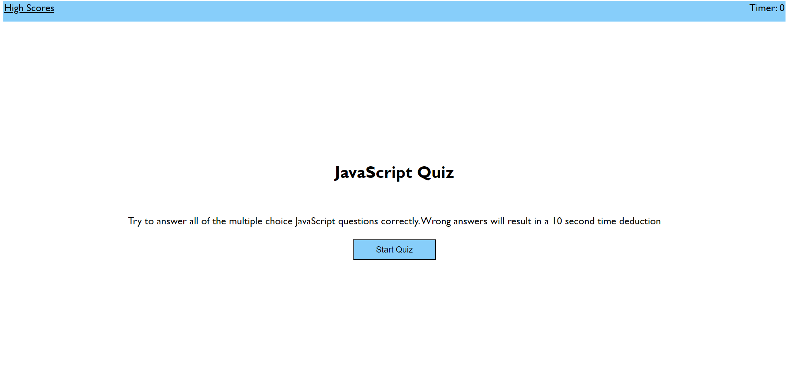
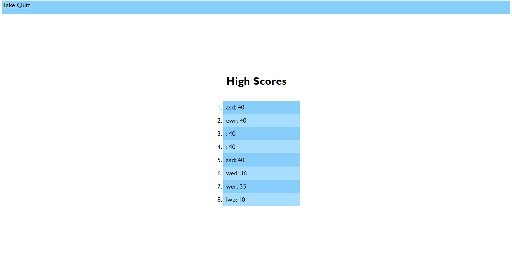

# JavaScript-Quiz

## Description

- I wanted to have a deployed webpage that I can use to take a quiz over JavaScript.
- I did this project to create a fun way to study the material covered in the JavaScript module.
- The site is very simple, and easy to navigate, and uses code with added notes in HTML, CSS, and JavaScript, so it is very useful to review.
- While creating the game, I learned a lot about how to write functions in script, and how something like CSS can affect the script and add new problems to solve.

## Installation

- Link to deployed website: https://luwylbab.github.io/JavaScript-Quiz/

- Get SSH key from https://github.com/Luwylbab/JavaScript-Quiz

- Clone the repository using [git@github.com:Luwylbab/JavaScript-Quiz.git]

## Usage

- To start the quiz, simply click the "Start Quiz" button, and answer all of the following questions. Once all the questions are answered, a user will be shown their final score, and can choose to submit it to the leaderboard. To view the leaderboard, click the "High Scores" link at the top left corner of the page.

## Credits

- README Guide: https://coding-boot-camp.github.io/full-stack/github/professional-readme-guide

- Used Xpert Learning Assistant to help with script functions for the timer, logging into local storage, and for some of the CSS: https://bootcampspot.instructure.com/courses/4612/external_tools/313